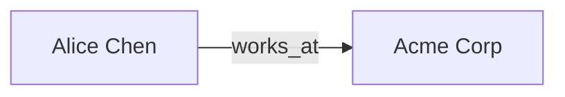

# <Report title>

## Answer

<Synthesized prose grounded strictly in the KG. Reference entities inline as
`[[<mykg_id>|<display name>]]`. When a fact spans domains, name the domain.>

## Diagram

<Optional. Mermaid block for relationships/flow, e.g.:

or an embedded PNG chart:

![[assets/<slug>-01.png]]
>

## Key entities

- [[<mykg_id>|<display name>]] — <one-line role in this answer>

## Domains & grounding

- Domains read: <Research, Yard, ...>
- All statements above are grounded in nodes.jsonl / edges.jsonl for those domains.
